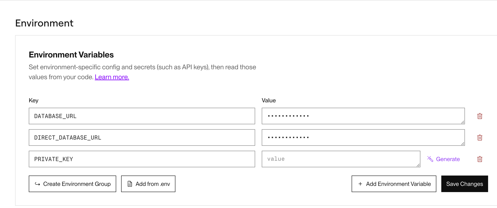
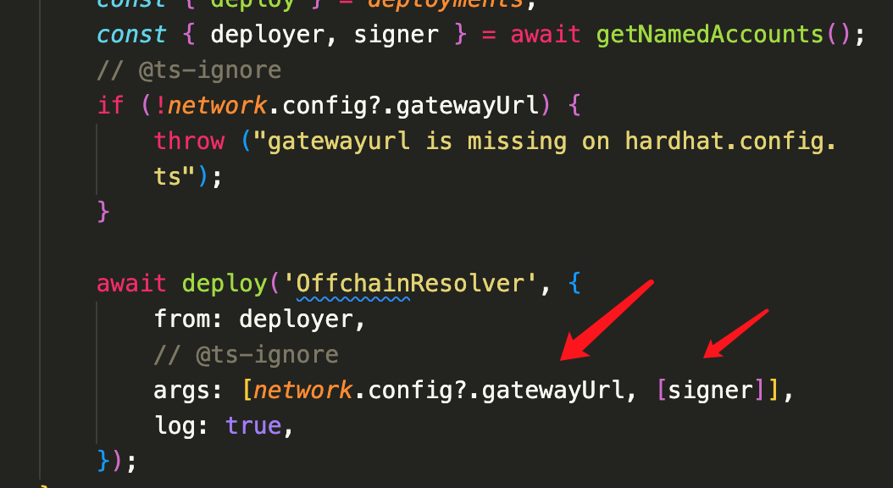
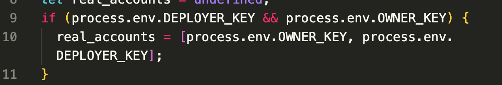
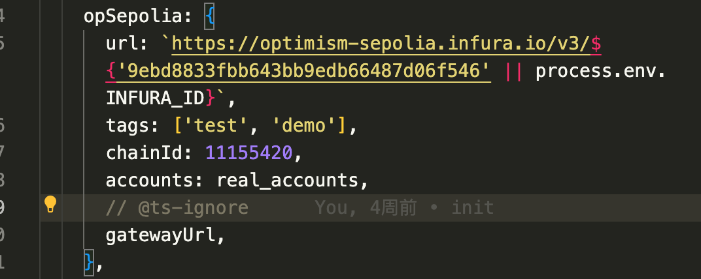
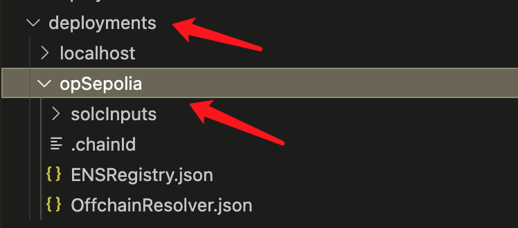
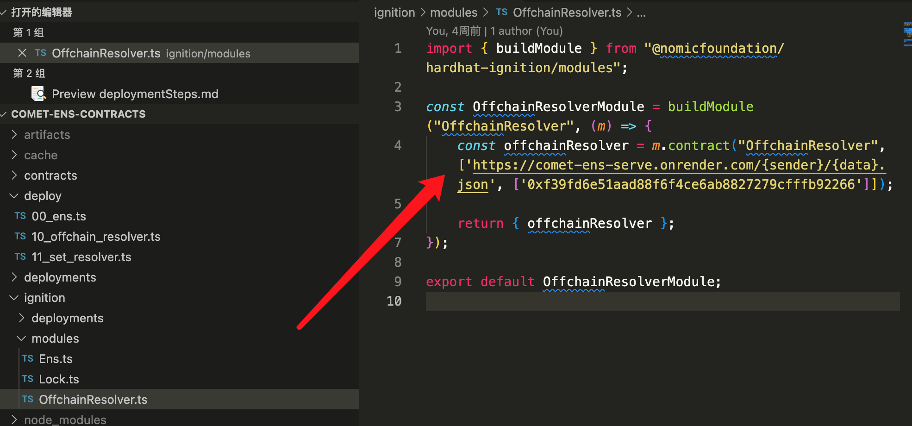

# 部署过程

## 部署测试链的过程

1. 根据私钥部署中心化的解析服务器，

得到一个中心化的解析服务器的地址，然后合约部署的时候要使用。

2. 合约部署

这里放入你准备好的私钥，然后配置网络

例如这样，

然后，`hardhat deploy --network opSepolia`

就可以了。

这个目录就会出现相关的部署信息，以上就是部署到测试链的过程。

## 部署主链的过程

部署主链，我们只要部署 OfferResolver 合约即可。

更改相应的参数，然后部署即可。

`npx hardhat ignition deploy ./ignition/modules/OffchainResolver.ts --network mainnet`

得到部署之后的地址后，
在 ens 管理界面，把需要解析的 ens 名字的解析地址设成刚部署得到的合约地址。

完成。
